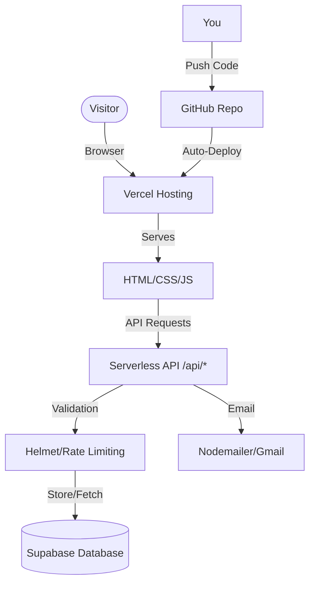

# 🚀 Deployment Guide: Silicon Nexus Portfolio

This guide illustrates how to deploy your portfolio using the **GitHub + Vercel + Supabase** stack. This combination provides a free, scalable, and professional-grade hosting environment with a SQL database.

## 🏗️ Architecture Overview



---

## 🛠️ Step-by-Step Procedure

### Phase 1: GitHub (Source Control)
**Why?** Stores your code and triggers automatic deployments when you push changes.

1.  **Initialize Git** (I've already done this for you locally!).
2.  **Create a Repository:**
    *   Go to [GitHub.com/new](https://github.com/new).
    *   Name it `silicon-nexus-portfolio`.
    *   Keep it **Public** (or Private).
    *   **Do not** initialize with README/gitignore (I already made them).
    *   Click **Create repository**.
3.  **Push Code:**
    Run these commands in your portfolio folder terminal:
    ```bash
    git remote add origin https://github.com/YOUR_USERNAME/silicon-nexus-portfolio.git
    git branch -M main
    git push -u origin main
    ```

### Phase 2: Supabase (Database)
**Why?** Stores contact messages and visitor analytics in a real SQL database.

1.  **Create Project:**
    *   Go to [Supabase.com](https://supabase.com).
    *   Click **New Project**.
    *   Give it a name and secure password.
    *   Region: Choose one close to you (e.g., Mumbai, Singapore).
2.  **Run SQL Schema:**
    *   Go to **SQL Editor** (sidebar icon).
    *   Click **New Query**.
    *   Copy the contents of `db/schema.sql` from your project folder.
    *   Paste it into the editor and click **Run**.
    *   *(This creates the `contacts` and `visitors` tables with security rules)*.
3.  **Get Credentials:**
    *   Go to **Project Settings** (gear icon) -> **API**.
    *   Copy the **Project URL**.
    *   Copy the **service_role** secret (reveal it). **Keep this secret!**

### Phase 3: Vercel (Hosting)
**Why?** Hosts your website tailored for Node.js apps, with free SSL and global CDN.

1.  **Import Project:**
    *   Go to [Vercel.com](https://vercel.com) -> **Add New** -> **Project**.
    *   Click **Continue with GitHub**.
    *   Select your `silicon-nexus-portfolio` repo.
2.  **Configure:**
    *   **Framework Preset:** Leave as "Other" or "Node.js".
    *   **Root Directory:** `./` (default).
    *   **Environment Variables:** Add the following (mostly from your `.env` file):
        *   `SUPABASE_URL`: (Paste from Phase 2)
        *   `SUPABASE_SERVICE_KEY`: (Paste service_role key from Phase 2)
        *   `EMAIL_USER`: `karthickeaswar43815@gmail.com`
        *   `EMAIL_PASS`: (Your Gmail App Password)
        *   `ADMIN_SECRET`: (Create a strong password for yourself)
3.  **Deploy:**
    *   Click **Deploy**.
    *   Wait ~1 minute. Vercel will build and launch your site! 🚀

---

## 🌐 Alternatives Explained

**Why not Firebase?**
Firebase is excellent but uses a NoSQL database (Firestore) which requires a different data structure than the SQL schema we designed. Our backend uses `better-sqlite3` logic (adapted to Supabase Postgres), which is cleaner for relational data like messages and logs.

**Why not Netlify?**
Netlify is great too! If you prefer Netlify:
1. Connect GitHub repo to Netlify.
2. Set "Build Command" to `npm install` and "Publish Directory" to `public` (or root).
3. Add the same Environment Variables in 'Site Settings' > 'Environment Variables'.
3. Note: You might need a `netlify.toml` adaptor for Express API routes, whereas Vercel handles `api/` folders natively or via `vercel.json` rewrites (which I provided).

---

## ✅ Verification
Once deployed:
1. Visit your Vercel URL (e.g., `https://silicon-nexus.vercel.app`).
2. Submit the contact form.
3. Check your Supabase table editor -> `contacts` table. You should see the message!
